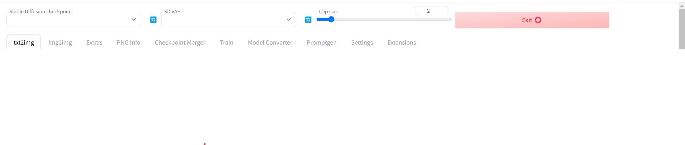
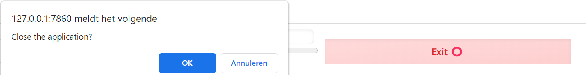

# sd_shutdown_button
Easy way to exit stable diffusion web ui

# What is this?
This is an extension made for [AUTOMATIC1111's stable-diffusion-webui](https://github.com/AUTOMATIC1111/stable-diffusion-webui)

# How does it work?
- Click on the exit button 

afterwards this pop up appears on your tab

- .press OK if you want to exit the application ,  the stable diffusion tab will be automatically closed
and the program will be stopped.

- If you want to stay ,press the other button

# credits 
- I received some help from Automatic,showing me a function I needed for this extension.
-  Also, I used some code from yuntian-deng  at https://huggingface.co/spaces/yuntian-deng/Gradio-Popup-Confirmation-Demo/tree/main

# update
12-08-23:  automatically closing the tab feature
             - however it's important  do this:  
                - whenever you start the webui and you see  the public url
                
               
                keep ctrl (control) pressed and click on the link. 
                Now the new feature should be working.

           or add the  --autolaunch   argument

 ## potential issue: 
 If the tab doesn't close no worries, it's a browser thing.Your webui is shutdown.
                you will see this 

               

           
            

             
             
             

